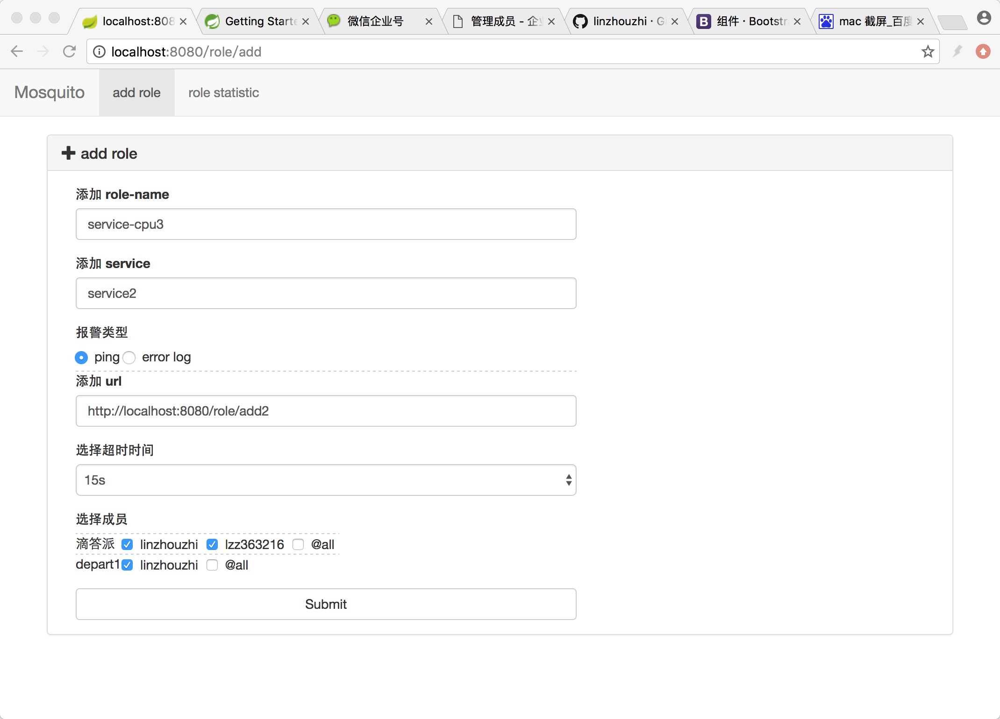
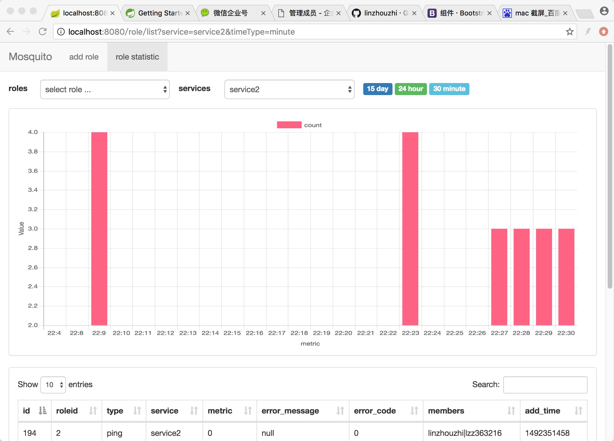
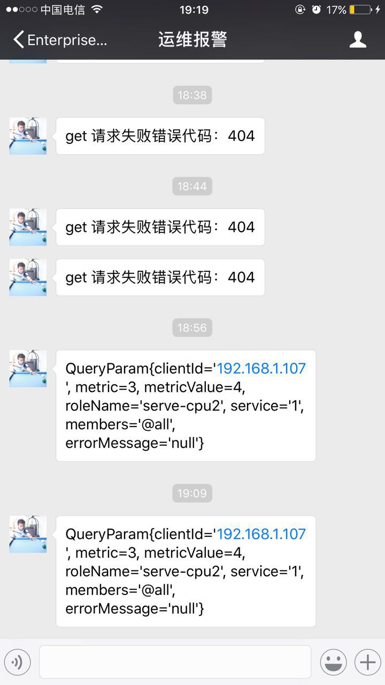

# mosquito
> mosquito 错误报警监控系统，mosquito 像一只蚊子一样你不处理它就会烦，当程序出现错误的时候会通过一直通过微信进行报警并且统计错误信息

## 一、介绍
    很多公司对错误的报警方式都是通过邮件提醒的，但是这种方式不及时也没有统计的功能，不利于我们分析错误的原因。而且通用性不强，
    mosquito 提供了两种方式，第一种是主动 ping service-url 来确认service是否挂掉，第二种是通过 restful 的接口由 service 主动推送消息。
   
## 二、安装
> 安装主要分为三个步骤，申请微信企业号、配置 mysql 数据库、运行 Application 就可以了。

* 1 申请微信企业号获取 corpid corpsecret
* 2 创建 mysql mosquito 数据库
* 3 运行 Application

## 三、使用
> mosquito 有两个界面一个 restful 接口，第一个是 (add roles) 可以添加 role 每一个role就是一条报警规则，(log statistic) 是统计错误日志的界面，restful 接口是通过http方式添加role.

### 3.1 add roles
> 添加 role 每一条 role 就是一个报警规则，目前有两种方式一种是 ping 某个service-url,另一种是 error log 每分钟统计一次



### 3.2 log statistic
> log statistic 是报警日志的统计界面，可以看到每个 role 的报警结果



### 3.3 restful(add role)
> 通过 restful 进行报警，这样通用性更强可以监控任何一个运行在 linux 上的service,监控 service 的连接数 cpu memory.

```
metric:是报警阀值
metricValue: 是具体监控值，当这个值超过 metric 就会微信报警
service：是 service 的名称
members: 是报警的成员 @all 表示所有的
roleName: 表示报警规则，比如 cpu mem ...
clientId: 是你的客户端 ip,这样你可以在你的电脑上直接看到你到监控结果
最后参数http 地址是 restful 接口

curl  -l -H "Content-type: application/json" -X POST -d  '{"metric":3,"metricValue":4,"service":"service1","members":"@all","roleName":"serve-cpu2","clientId":"192.168.1.107"}'  http://localhost:8080/role/add_log
```

### 3.4 微信报警结果


## 例子
### 1 监控链接数
> 监控 8081 端口到链接，如果超过 3个 我们就进行报警

watch -n 1 'netstat -nat | grep "8081" | wc -l | xargs ./curl_info.sh'
``` curl_info.sh
#!/bin/bash
if [ $1 -gt 3 ];then
    curl  -l -H "Content-type: application/json" -X POST -d  '{"metric":3,"metricValue":${1},"service":"service1","members":"@all","roleName":"serve-cpu2","clientId":"192.168.1.107"}'  http://localhost:8080/role/add_log
fi
```
